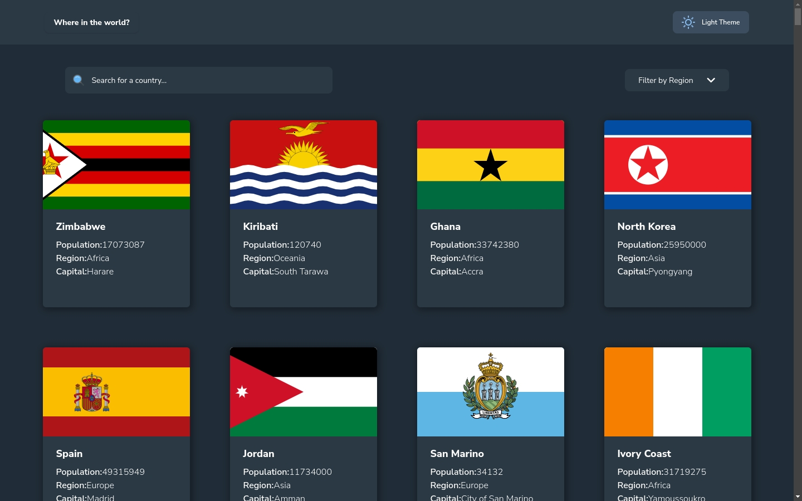
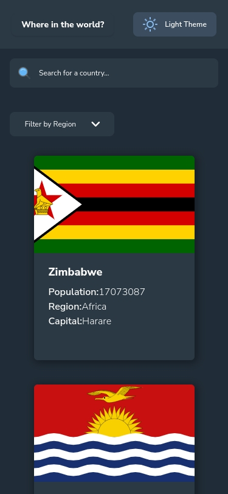
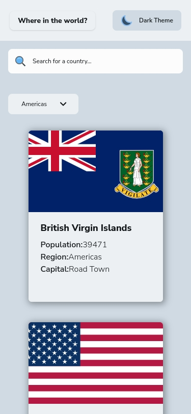
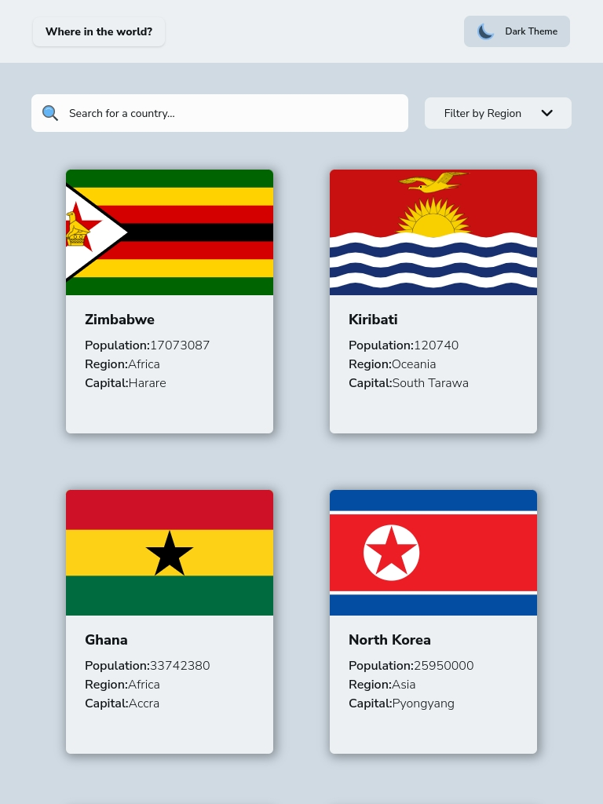
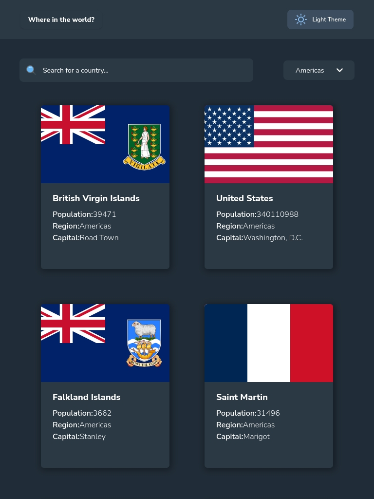
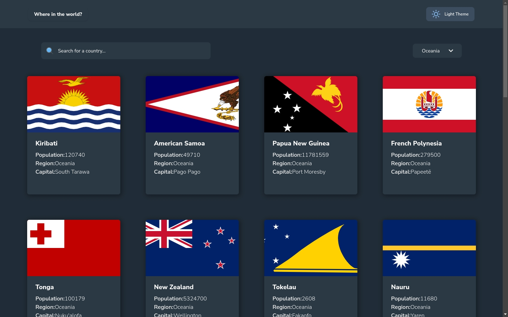
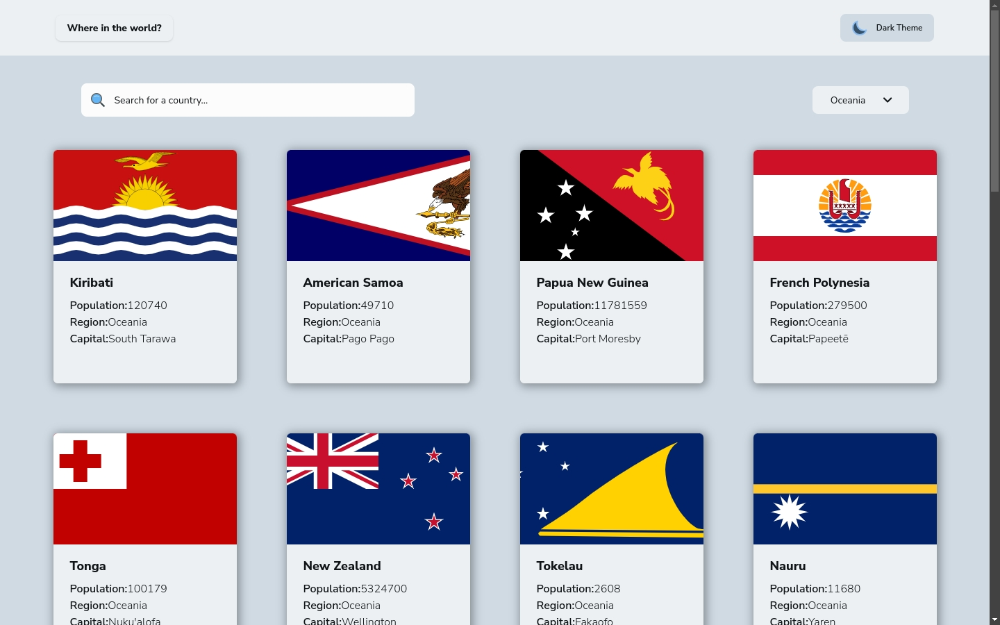

# Frontend Mentor - REST Countries API with color theme switcher solution

This is a solution to the [REST Countries API with color theme switcher challenge on Frontend Mentor](https://www.frontendmentor.io/challenges/rest-countries-api-with-color-theme-switcher-5cacc469fec04111f7b848ca). Frontend Mentor challenges help you improve your coding skills by building realistic projects. 

## Table of contents

- [Overview](#overview)
  - [The challenge](#the-challenge)
  - [Screenshot](#screenshot)
  - [Links](#links)
- [My process](#my-process)
  - [Built with](#built-with)
  - [What I learned](#what-i-learned)
  - [Useful resources](#useful-resources)
- [Author](#author)

## Overview

### The challenge

Users should be able to:

- See all countries from the API on the homepage
- Search for a country using an `input` field
- Filter countries by region
- Click on a country to see more detailed information on a separate page
- Click through to the border countries on the detail page
- Toggle the color scheme between light and dark mode

### Screenshot









### Links

- Solution URL: [Add solution URL here](https://your-solution-url.com)
- Live Site URL: [Add live site URL here](https://your-live-site-url.com)

## My process

### Built with

- Semantic HTML5 markup
- CSS custom properties
- Flexbox
- CSS Grid
- Mobile-first workflow
- [React](https://reactjs.org/) - JS library
- [React Router DOM](https://reactrouter.com/) - Routing
- [Tailwind CSS](https://tailwindcss.com/) - CSS framework
- [Vite](https://vitejs.dev/) - Build tool

### What I learned

This project helped me practice:

- **React Hooks**: useState, useEffect, useCallback, useMemo, useRef, useContext
- **Custom Hooks**: Created reusable hooks like `useFetch` and `useThemeSelect`
- **Context API**: Global state management for countries data and theme
- **Accessibility (WCAG 2.2)**: ARIA attributes, keyboard navigation, focus management, semantic HTML
- **REST API Integration**: Fetching data from REST Countries API
- **Dark/Light Theme**: CSS custom variants and class-based theme switching

Example of custom hook:
```js
const useFetch = (fetchApi) => {
    const [data, setData] = useState(null);
    const [loading, setLoading] = useState(true);
    const [error, setError] = useState(null);

    useEffect(() => {
        const getData = async () => {
            try {
                const result = await fetchApi();
                setData(result);
            } catch (err) {
                setError(err.message);
            } finally {
                setLoading(false);
            }
        };
        getData();
    }, [fetchApi]);
    
    return { data, loading, error };
}
```

### Useful resources

- [REST Countries API](https://restcountries.com/) - API used for country data
- [React Docs](https://react.dev/) - Official React documentation
- [Tailwind CSS Docs](https://tailwindcss.com/docs) - Tailwind CSS reference
- [WCAG 2.2 Guidelines](https://www.w3.org/WAI/WCAG21/quickref/) - Accessibility guidelines

## Author

- Frontend Mentor - [@rf1303](https://www.frontendmentor.io/profile/rf1303)
- GitHub - [@rf1303](https://github.com/rf1303)
- Linkedin - [@Ramiro Fernandez](https://www.linkedin.com/in/ramiro-fernandez-260935125/)
